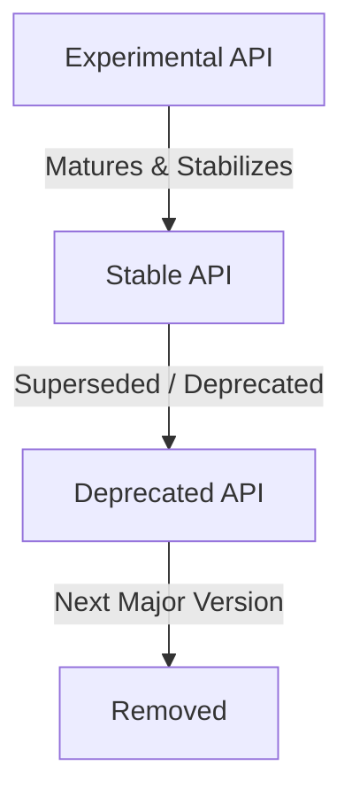

# SxnnyErgo Product Vision

This document establishes the immutable product vision, design principles, and architectural boundaries for SxnnyErgo. It serves as the canonical source of truth for maintainers, contributors, and users. Future development, API additions, audits, and refactoring efforts must align with the policies and philosophies defined herein.

---

## 1. What is SxnnyErgo?

SxnnyErgo is an open-source Swift Package containing ergonomic utilities, helper abstractions, and foundational layout blocks that extend and enhance native SwiftUI. It is designed to act as an ergonomic standard library companion rather than a standalone UI framework or custom design system.

---

## 2. Mission

The mission of SxnnyErgo is to maximize developer productivity and code readability when building Apple platform applications using SwiftUI. SxnnyErgo aims to eliminate common boilerplate, simplify complex state synchronization patterns, and provide highly expressive modifiers that native SwiftUI omits, without introducing proprietary design rules, heavy dependencies, or non-idiomatic abstractions.

---

## 3. Vision

SxnnyErgo aspires to be the first dependency Apple platform developers add to their Swift Packages—a trusted, lightweight layer of utilities that feels indistinguishable from SwiftUI itself. Over time, it will evolve to match Apple's platform changes, serving as a bridge that fills ergonomic gaps in SwiftUI while keeping pace with modern Swift language features (such as Swift Concurrency, Macros, and the Observation framework).

---

## 4. Target Audience

SxnnyErgo is tailored for:
* **Indie Developers and Startups:** Who need to move rapidly without sacrificing code cleanliness, readability, or performance.
* **Apple Platform Teams in Larger Organizations:** Who want to establish clean, unified utility layers across multiple internal apps without introducing opinionated styling frameworks.
* **Solo iOS/macOS/multiplatform Developers:** Who value developer ergonomics and wish to write expressive, concise declarative code.

---

## 5. Non-Target Audience

SxnnyErgo is explicitly **not** designed for:
* **Teams seeking a drop-in Design System:** Developers looking for pre-styled component libraries (such as material themes or complete custom UI kits) will not find them here.
* **Cross-Platform Developers bypassing Apple's Design Language:** Teams attempting to force non-Apple designs or web-style layout paradigms onto Apple platforms.
* **Developers seeking a SwiftUI replacement:** Developers who prefer UIKit/AppKit paradigms or wish to bypass the declarative layout engine.

---

## 6. Core Principles

Every contribution, refactor, and design decision in SxnnyErgo must be guided by these ten core principles:

1. **SwiftUI First:** All APIs must align with native SwiftUI paradigms. If a feature cannot be expressed cleanly within a declarative context, it does not belong in SxnnyErgo.
2. **Progressive Adoption:** Developers should be able to adopt a single modifier or utility without restructuring their existing codebase or buying into an all-or-nothing architecture.
3. **Composition over Configuration:** APIs must favor small, composable building blocks and view modifiers over complex, highly parameterized views.
4. **Ergonomic Leverage:** An API must deliver a clear, measurable reduction in cognitive load, boilerplates, or call-site verbosity compared to native SwiftUI.
5. **Zero Performance Overhead:** Utilities must compile down to efficient SwiftUI layouts. Avoid unnecessary dynamic type wrapping, layout passes, or CPU-bound allocations.
6. **Native API Preservation:** SxnnyErgo must never hide the underlying SwiftUI primitives. Builders and modifiers must return standard SwiftUI types or easily convertible wrappers.
7. **Strict Predictability:** Naming, parameter order, defaults, and behaviors must mirror standard Apple framework conventions to reduce developer learning curves.
8. **Built-in Accessibility (a11y):** Any layout utility or wrapper must preserve or enhance accessibility properties (e.g., dynamic type scaling, voiceover, contrast support) automatically.
9. **Documentation-Driven Design:** An API is not complete until it has comprehensive, interactive DocC documentation, clear code examples, and explicit usage guidelines.
10. **Platform Agnosticism:** Unless technically impossible due to OS limitations, all features must support iOS, macOS, watchOS, tvOS, and visionOS equally.

---

## 7. Project Scope

### In-Scope
* **Ergonomic Modifiers:** Extensions that reduce boilerplates (e.g., conditional modifiers, layout shortcuts, animation helpers).
* **Missing Layout Primitives:** Pure layout utilities that simplify alignment, spacing, or content wrapping not easily expressed with standard stacks.
* **State & Binding Helpers:** Ergonomic properties, property wrappers, or bindings that ease data flow within SwiftUI views.
* **Platform Adaptation Utilities:** Clean abstractions to handle multi-platform variations without polluting view bodies with `#if os(...)` checks.

### Out-of-Scope
* **Custom Styled Components:** Custom buttons, inputs, alerts, or widgets that dictate a specific visual brand.
* **Networking or Core Business Logic:** Utilities for API requests, local database synchronization, or domain model management.
* **Navigation Frameworks:** Replacement navigation routers, coordinator patterns, or deep-linking engines.
* **Proprietary Styling Engines:** Custom theme providers or stylesheet parsers that replace SwiftUI’s environment-based styling.

---

## 8. Design Philosophy

SxnnyErgo prioritizes developer experience (DX) and call-site elegance. The design of any component or utility must adhere to the following tenets:
* **The "Invisible" API:** The code using SxnnyErgo should read as if it were written by Apple. It should blend seamlessly with native SwiftUI.
* **Minimalist Footprint:** Every modifier should do exactly one thing. Avoid combining layout, styling, and behavior into single monolithic calls.
* **Compile-Time Safety:** Favor type-safe configurations, Swift enums, and strong types over string configurations or runtime checks.

---

## 9. API Philosophy

To maintain a unified feel, all public APIs must conform to the following strict guidelines:

* **Swift API Design Guidelines:** Strictly follow Apple's Swift API Design Guidelines (e.g., grammatical naming, clarity over brevity).
* **Discoverability via Extensions:** Attach modifiers to standard SwiftUI types (`View`, `Binding`, `Color`, etc.) to maximize autocomplete discoverability.
* **Sensible Defaults:** Every initializer must provide sensible, platform-appropriate default parameters to enable rapid prototyping while remaining configurable.
* **Modifier Chain Preservation:** Ensure all view modifiers return `some View` (or a specific type conforming to `View` where needed for chaining) to prevent breaking standard SwiftUI composition.
* **No Side-Effects in View Initializers:** Initializers must be lightweight, pure, and fast. Heavy computational or side-effect-producing setup belongs inside lifecycles (e.g., `.task` or `.onAppear`).

---

## 10. Compatibility Policy

* **Deployment Targets:** SxnnyErgo targets modern, actively supported OS releases. The minimum deployment target will be evaluated annually and aligned with the version that covers ~90% of active devices in commercial applications (typically matching the current OS minus two versions, e.g., iOS 16+ / macOS 13+).
* **Semantic Versioning:** SxnnyErgo strictly follows Semantic Versioning (SemVer 2.0.0).
* **Breaking Changes:** Breaking changes are restricted to major version bumps and must be preceded by a full release cycle containing deprecation warnings.
* **Deprecation Lifecycle:** Deprecated APIs must remain functional for at least one full minor release cycle, accompanied by Swift compiler warnings indicating the replacement API.

---

## 11. Stability Policy

To ensure developers can trust SxnnyErgo in production, all public APIs must move through a structured lifecycle:

* **Experimental:** New, highly requested features that require feedback. They must be marked with `@_documentation(visibility: internal)` or clearly documented as experimental. They can change without a major version bump.
* **Stable:** Production-ready APIs with strict source and binary compatibility guarantees.
* **Deprecated:** Outdated or superseded APIs marked with `@available(*, deprecated, renamed: "...")` warnings.
* **Removed:** APIs that have passed their deprecation cycle and are physically removed from the codebase in a major release.

---

## 12. Goals

* **Boilerplate Reduction:** Build a comprehensive set of modifiers that address the top 10 most common boilerplate patterns in SwiftUI.
* **First-Class Performance:** Maintain a test suite that monitors view updates and renders times to guarantee zero layout regression.
* **Uncompromising Documentation:** Achieve 100% DocC coverage with compile-validated code snippets for every public declaration.
* **High Contributor Ergonomics:** Maintain clear contributor templates, lint setups, and test suites to make contributing trivial.

---

## 13. Non-Goals

* **We will not build an ecosystem:** SxnnyErgo will not attempt to spin up sub-libraries, plugin systems, or massive dependency graphs.
* **We will not replace SwiftUI APIs:** SxnnyErgo will never duplicate or wrap SwiftUI APIs simply to change their naming scheme if the underlying mechanics are unchanged.
* **We will not support obsolete platforms:** We will not maintain compatibility with platforms or OS versions that have been deprecated by Apple.

---

## 14. Definition of a Minimum Lovable Product (MLP)

SxnnyErgo achieves MLP status when the following qualitative standard is met:
1. **Frictionless Integration:** A developer can add the Swift Package and use their first modifier in under 60 seconds.
2. **Complete Predictability:** The developer never has to refer to the documentation to guess how to chain modifiers or what properties are available; the API is completely discoverable via autocomplete.
3. **Flawless a11y & Layout Compliance:** Every layout helper respects dynamic type, safe areas, and alignment guides out of the box.
4. **Zero Compiler Warnings:** The package compiles cleanly under the strictest Swift compiler options, including complete strict concurrency checking.

---

## 15. Success Metrics

We measure the success and health of SxnnyErgo through the following engineering-oriented metrics:
* **API Deprecation Window Compliance:** 100% adherence to the deprecation policy prior to breaking change implementation.
* **DocC Coverage Ratio:** Maintain a stable 100% documentation coverage score across all public interfaces.
* **Issue-to-Resolution Time:** Maintain low cycle times on bugs impacting stable APIs.
* **Test Suite Verification:** 100% passing tests across all target OS platforms, verifying consistent behavior across iOS, macOS, watchOS, tvOS, and visionOS.
